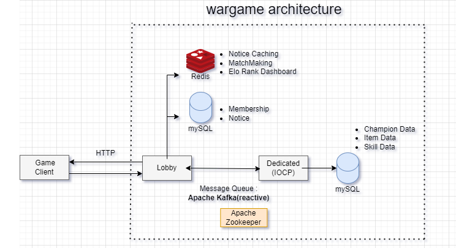

# wargame-server

다음 라이브러리를 설치해야합니다.  

modern-cpp-kafka-main  
librdkafka.redist.2.3.0  
boost_1_84_0  
mysql.8.0

기존 구조는 IOCP로 구현한 게임서버 내에 접속해서 로비와 매치메이킹, 게임 기능을 전부 수행했습니다.

로비의 기능은 요청에 대한 응답만 필요하기에 실시간으로 통신하는 **소켓 서버에는 부적합**하다고 판해서 Flask로 간단하게 구축했었습니다.

그러나, 비동기로 Non-Blocking하게 통신하는 IOCP의 특징을 살리고자 Spring Webflux로 마이그레이션했습니다.

기존의 로비는 게임 서버와 HTTP로 통신했지만, Apache Kafka를 이용해 Async 방식으로 IPC 통신을 구현했습니다.

