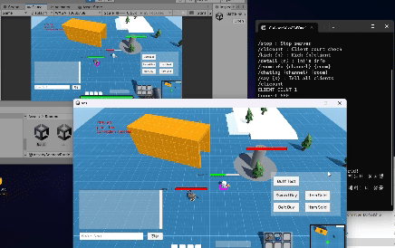
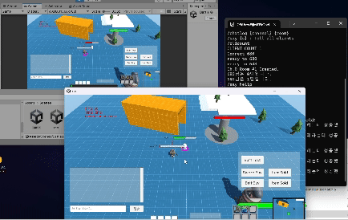

## wargame

자세한 개발 과정은 이슈에 작성하고 있습니다.  
   

### 게임 소개

---

간단한 MOBA 게임을 개발했습니다.

Unity3d 클라이언트에서 원활하게 통신하기 위해 `recv_thread`와 `send_thread`를 C#으로 비동기 처리했습니다.

게임 서버는 Windows 환경에서 C++로 `I/O Completion Port`를 사용해서 구축했습니다.

이러한 비동기, Non-Blocking의 장점을 살리고자 로비 백엔드를 `Spring Webflux`로 마이그레이션 했습니다.
  

### 아키텍처 구조

다음 라이브러리를 설치해야합니다.
- modern-cpp-kafka-main
- librdkafka.redist.2.3.0
- mysql.8.0    
   

초기 구조는 IOCP(`I/O Completion Port`)로 구현한 게임서버 내에 접속해서 로비와 매치메이킹, 게임 기능을 전부 수행했습니다.

로비의 기능은 요청에 대한 응답만 필요하기에 실시간으로 통신하는 **소켓 서버에는 부적합**하다고 판단했습니다.

Flask로 간단하게 구축했었지만 비동기로 Non-Blocking하게 통신하는 IOCP의 특징을 살리고자 `Spring Webflux`로 마이그레이션했습니다.

기존의 로비는 게임 서버와 HTTP로 통신했지만, `Apache Kafka`를 이용해 Async 방식으로 IPC 통신을 구현했습니다.
   
   

rdkafka 추가로 `listen()` 오류가 뜨자 라이브러리 충돌로 판단, Kafka Message를 받는 middleware(`kafka_learn.sln`)을 구성
  - 2024-04-28 functional과 winsock2의 충돌로 원인 파악, 해결해서 게임 서버에 통합(`kakfa.h`)

 
----
   

### 백엔드 기술 스택

back-end : Spring Webflux, r2dbc(mysql)  
middleware : ReactiveRedis, ReactiveKafka, Vault, Prometheus, Grafana, Docker-Compose
  

#### 왜 Apache Kafka를 사용했는가?
게임 서버와 로비 서버간의 IPC를 위해서
#### 왜 Redis 를 사용했는가
매치메이킹 과정에서 이용하기 위함
#### 왜 Spring Webflux를 사용했는가?
고성능 퍼포먼스를 위해 IOCP를 사용한 게임서버에 맞춰서 동기적 이벤트를 줄이기 위함
#### 왜 r2dbc를 사용했는가?
spring webflux처럼 비동기, Non-Blocking으로 작업하는 경우 데이터베이스를 관리하기 마땅한 프레임워크가 유일

### 백엔드 주요 기능 

- 매치메이킹
  - Spring Boot 스케쥴러를 통해서 Redis의 대기열 큐를 확인하는 매치 시스템 (Polling 방식)
  - Kafka를 통해 게임 서버로 매칭 결과를 전달, 게임 서버는 게임 전적 결과를 로비로 전송
- 사용자 로그인 (인가, Authentication)
  - Vault를 통해 민감한 사용자의 데이터를 암호화/복호화
- 사용자 커뮤니티
  - 게시글 작성자, 게시글 내용 표시와 댓글 기능, 좋아요 기능
  - 현재 페이지에서 관리자의 공지사항, 좋아요 상위 3개까지 가장 상단에 표시
- 게임 전적 결과 보기
  - 기본적으로 나의 전적 보기를 지원
  - 검색 기능을 통해서 원하는 사용자의 전적을 검색
- 명예의 전당 표시
  - 게임 내 레이팅 점수(Elo)의 상위 10명의 랭커의 정보를 게시

  
  
### 게임 스크린샷
테스트 시연 영상입니다.  

#### [아이템 구매와 판매를 표시]

   

#### [채팅 시스템]  
  
서버는 밴픽창에서의 채팅과 구분해서 인게임 채팅을 기록합니다. 
 

#### [공격과 사망 구현]  

  