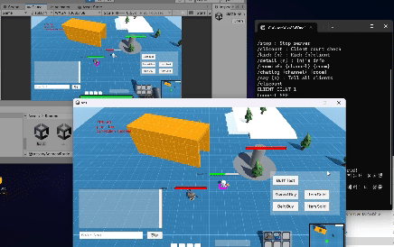
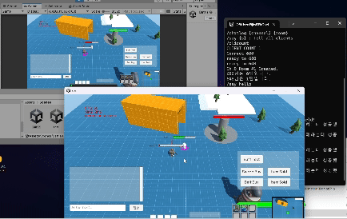

## wargame

 

1인개발로 간단한 실시간 MOBA 게임 프로젝트(AOS)를 진행하고 있습니다.

정말 좋아서 애착을 가지고 있어, 기간에 구애받지 않고 꾸준히 업데이트하고 있습니다. 

 
자세한 개발 내용은 기술 블로그와 Issue에서 작성하고 있습니다.
<ol>
    <li><a href="https://downfa11.tistory.com/60">MSA? 이길 수 없다면 합류해라 (feat. Kafka IPC 트러블슈팅)</a></li>
    <li><a href="https://downfa11.tistory.com/61">CQRS 패턴을 이용한 데이터 쿼리 - 게임 전적과 통계 구현</a></li>
    <li><a href="https://downfa11.tistory.com/63">사용자 경험을 위한 시도 (Banner 구현, Addressable 패치)</a></li>
    <li><a href="https://downfa11.tistory.com/64">매칭 서버의 대규모 트래픽 시험 검증하기 (feat. Kafka 성능 튜닝)</a></li>
</ol>

 

### 서비스 아키텍처 변천사
---
1. 단일 게임서버
   - IOCP(`I/O Completion Port`)로 구현한 게임서버에서 로비와 매치메이킹, 게임 기능 전부 수행

2. Flask 기반의 백엔드 구축
   - 로비는 요청에 대한 응답만 필요하기에 실시간으로 통신하는 **소켓 서버에는 부적합**하다고 판단
   - 정적인 기능을 다루는 웹 백엔드를 Flask로 간단하게 구축, HTTP 방식으로 게임서버와 통신

3. Spring Webflux 기반의 백엔드 마이그레이션
   - 비동기, Non-Blocking 통신하고 있는 게임서버-클라이언트의 장점을 살리고자 `Spring Webflux`로 마이그레이션

4. MSA 구조 마이그레이션
   - Windows 게임 서버와 함께 관리하여 유연하게 대응할 수 있도록 각 도메인별로 마이크로 서비스로 분해
   - 사용자의 실력 점수에 기반한 매치메이킹을 담당하는 서비스를 분리하여 기존 모놀리식 구조의 부하 해소
   - `ReactiveKafka`를 이용해 각 마이크로 서비스간 IPC 구현 (**게임서버도 마이크로 서비스 취급**)

 

컨테이너화하여 애플리케이션을 Kubernetes(AWS EKS) 환경에서 배포하고자 합니다. 

현재 클라이언트 업데이트중이라 아직 배포를 시도하지 않고 있습니다.

 

### 기술스택

---

 

### 주요 기능 

---

- Bounded Context 설계를 통한 마이크로 서비스 분해
  - [기술 블로그](https://downfa11.tistory.com/58)

- Kafka를 이용한 각 마이크로 서비스간의 통신IPC 구현
  - 예시: 피드 서비스에서 게시글 작성시, 회원 서비스에서 사용자 정보를 전달받는 비즈니스 로직

- Axon을 이용한 이벤트 소싱 방식의 사용자 데이터 관리
  - 수시로 변동되는 사용자의 실력점수(Elo), 게임코드의 정합성 유지가 **서비스상에서 매우 중요** 
  - Axon SnapShot을 이용해서 Event Replay시 비용 감소

- 사용자 로그인
  - 각 마이크로 서비스간의 인가(Authentication)를 위해 JWT 사용
  - Vault를 통해 민감한 사용자의 데이터를 암호화/복호화 (잠정 중단)

  
- 게임의 공지사항 패치노트 확인 등의 정적인 기능
  - 최신 공지사항 5개와 현재 진행중인 모든 이벤트를 동적으로 표시
  - 사용자 커뮤니티 - 공략, 자유게시판, 듀오모집 등으로 활용
    - 게시글 작성자, 게시글 내용 표시와 댓글 기능, 좋아요 기능
  - 현재 페이지에서 관리자의 공지사항, 좋아요 상위 3개까지 가장 상단에 표시

- 사용자의 실력점수에 기반한 매치메이킹 구현
  - Spring Boot 스케쥴러를 통해서 Redis의 대기열 큐를 확인하는 매치 시스템
  - Kafka를 통해 게임 서버로 매칭 결과를 전달, 게임 서버는 게임 전적 결과를 로비로 전송

- ElasticSearch를 이용한 사용자의 게임 결과전적 기록 실시간 조회 기능
  - 기본적으로 나의 전적 보기를 지원
  - 검색 기능을 통해서 원하는 사용자의 전적을 검색

- CQRS 패턴을 이용해 DynamoDB에 분석한 통계 데이터 조회
  - 각 사용자별 시즌별, 챔프별 전체 판수와 승률 조회
  - 각 챔프의 시즌별 전체 판수와 승률 조회

 

  
### 게임 스크린샷 (참고용)

---
클라이언트의 테스트 시연 영상입니다.

 

#### [아이템 구매와 판매를 표시]

 

#### [채팅 시스템]  
  
서버는 밴픽창에서의 채팅과 구분해서 인게임 채팅을 기록합니다. 

 

#### [공격과 사망 구현]  

 
