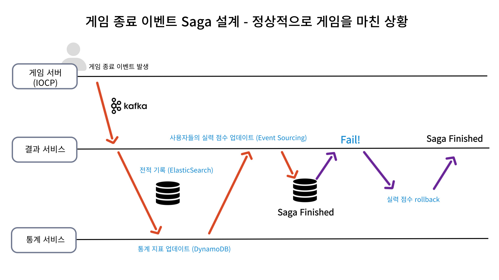

# wargame

간략한 소개 : IOCP 윈도우 서버를 포함한 실시간 MOBA 게임 

담당: 1인 개발 진행중 - (웹 백엔드, 게임 서버, 게임 클라이언트, 인프라)

개발기간: Mar.2023 ~ Current

 

자세한 개발 내용은 기술 블로그와 Issue에서 작성하고 있습니다.
- <a href="https://downfa11.tistory.com/category/project/wargame">기술 블로그 wargame 카테고리</a>
- <a href="https://github.com/downfa11/wargame-backend/issues">기술 관련 이슈 모음 (Github Issue)</a>

 
 

## Architecture

총 6개의 Bounded Context로 구성된 마이크로 서비스 구조 - [Bounded Context 분해](https://downfa11.tistory.com/58)
- 회원(membership), 인게임(IOCP), 매칭(match), 피드(feed), 전적(result), 통계(result-query)

 

1. GitOps를 통한 CI/CD 파이프라인 구축 (Github Actions, AWS ECR, ArgoCD)
2. 비즈니스 로직이 외부의 영향을 받지 않도록 Hexagonal Architecture 도입

 

### 기술 스택

2025.03.19 최신화

 

### 아키텍처 변천사
1. **단일 게임서버**
    - Windows 커널 오브젝트인 IOCP(`I/O Completion Port`)로 구현한 Proactor 기반 게임서버
2. **Flask 기반의 백엔드 구축**
    - 정적인 요청은 실시간으로 통신하는 소켓 서버에 부적합, Flask를 통해 간단한 백엔드 구축
3. **Reactor 기반 `Spring Webflux` 마이그레이션**
    - 논블로킹으로 통신하고 있는 게임서버-클라이언트의 장점을 살리고자 함
4. **MSA 마이그레이션**
    - Windows 게임 서버와 함께 관리하여 유연하게 대응하기 위해 분해
    - `ReactiveKafka`를 이용해 각 마이크로 서비스간 통신 구현

  

## 주요 기능 

### 한번에 10,000명의 사용자를 매치메이킹하는 트래픽 처리

Redis의 Sorted Set을 이용해서 비슷한 실력대(Elo)의 사용자끼리 매치메이킹

 

직접 구현한 API로 매칭 등록에 대한 트래픽 주입하여 진행
- C++ 서버에서 결과를 처리하기에 일반적인 통합테스트 진행이 어려움

중간에 유실되는 데이터 없이 한번에 10,000명씩 매칭 완료 (평균 16sec)
- 100,000명의 사용자 주입시 유실 없이 매칭 과정을 성공적으로 처리

  

### Windows 플랫폼에 종속된 게임서버의 배포 자동화
게임서버는 Windows의 커널 오브젝트를 이용해서 비동기식 처리하기 때문에 **플랫폼 종속적**

배포 과정이 번거롭기 때문에 웹 백엔드의 기존 CI/CD 파이프라인에 함께 진행하기 위한 시도
- 개발 환경에서 프로세스 격리 기술을 지원하지 않는 물리적 한계 (Windows 10,11 Home Hyper-v 기반)
- GitHub Actions의 경량 OS 컨테이너를 활용하여 배포 자동화를 구현

 

#### 베이스 이미지와 멀티 스테이징을 통해 이미지 경량화
잦은 배포 자동화시 ECR에서 버전별로 관리하기 부담됐다. (기존 이미지 크기는 약 6.89GB)

MSBuild를 통해 빌드된 C++ 파일만 다시 경량 이미지로 가져와서 약 25배 개선

  

### 전적 통계 서비스 제공

- 검색 기능을 통해서 원하는 사용자의 전적을 검색
    - ElasticSearch completion을 이용한 검색어 자동완성 기능
- 각 사용자별 시즌별, 챔프별 전체 판수와 승률 조회
- 각 챔프의 시즌별 전체 판수와 승률 조회

  

### Saga를 이용한 분산 트랜잭션 설계
[기술 블로그 상세](https://downfa11.tistory.com/81) - 사용자의 전적 갱신, 통계 업데이트 및 실력 점수(Elo) 변화를 트랜잭션으로 처리 

1. Kafka를 통해 게임서버로부터 결과 서비스가 게임 종료 이벤트를 수신
2. 완료된 이벤트의 상태 확인하여 작업 처리 (Success, Dodge)
- Success 경우
  - 우선적으로 전적 DB에 기록한다. (ElasticSearch)
  - 해당 전적에 속하는 사용자들에게 GameFinishedCommand 전달 (membership service)
  - 각 사용자들의 Elo 점수를 업데이트, gamecode 초기화
- Dodge 경우
  - 해당 전적에 속하는 사용자들에게 GameFinishedCommand 전달 (membership service)
  - 각 사용자들의 gamecode 초기화

이 과정에서 장애 발생시, 보상 트랜잭션을 전달해서 Elo 점수를 롤백
- 여러 장애 상황을 상정해서 트랜잭션의 롤백이 잘 이뤄지는지 검증

 
 

### 게임 내의 데이터 수집 파이프라인 구축 및 분석
성향 분석(각 사용자의 플레이 스타일)이나 비정상 행위 탐지(비매너 채팅이나 트롤링, 피딩 등)에 이용하고자 진행중

1. `logging.backend.topic`와 `logging.game.topic`로 나눠서 사용자 행위 데이터를 수집
2. Logstash를 통해 해당 토픽들 복사해서 분석 (Kafka → ELK)

- **웹 백엔드** : 공통 모듈(common) 수준에서 각 Controller 요청을 로깅 (Spring AOP)
- **게임 백엔드** : 각 티어나 점수대별로 분류, 목적에 맞는 데이터 직접 수집
  - 챔피언 선택 완료시 (`champion_selection`)
  - 킬/데스/어시스트(KDA)시 (`combat_kda`)
  - 아이템 구매/판매시 (`item_transactions`)
  - 채팅 메시지 전송시 (`chat_message`)

 

5분 단위로 수집해야하는 로그 종류 : `gold_transactions`, `cs_statistics`, `damage_statistics`
- 각 사용자들의 이동 경로(`player_movement`)는 10초마다 수집해야함

  

  
## 게임 시연 및 미리보기
이해를 돕기 위한 게임 클라이언트의 테스트 시연 영상입니다.

 

#### 병종과 포탑 구현

 

#### 상태이상(cc기) 구현

 

#### 게임 내 경제 활동 (아이템 매매)

 

#### 채팅 시스템
  
서버는 밴픽창에서의 채팅과 구분해서 인게임 채팅을 기록합니다. 

 

#### 공격과 사망 구현]

 

 

#### 게임서버의 데이터베이스 ERD

그냥 아까워서 올림
